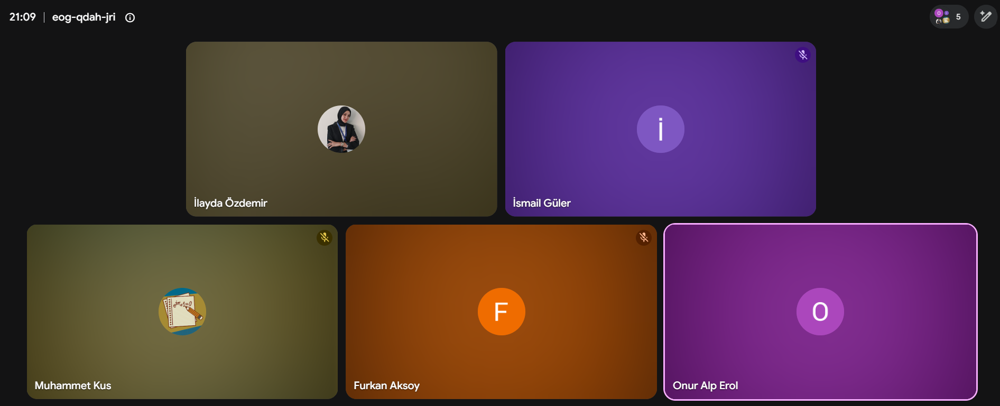

# Sprint 2 — Dokümanlar

## Daily Scrum
Toplantılar Google Meet + WhatsApp üzerinden sürdürüldü. Görüşülen konular: base
modellerdeki veri sızıntısı, nakit projeksiyonunun yeniden yazımı, Monte Carlo ile
olasılıksal kriz değerlendirmesi, şok/counterfactual senaryolarının tasarımı.

## Bu klasöre eklenecek görseller
- `sprint2_board.png` — Sprint 2 board görüntüsü (S2 kartları)
- `daily_scrum_meet.png` — Google Meet Daily Scrum toplantı ekran görüntüsü (5 üye)

## Tamamlanan işler (özet)
- Veri sızıntısı temizliği (as-of feature + TimeSeriesSplit)
- Nakit projeksiyonu yeniden yazımı (çifte sayım düzeltmesi)
- Monte Carlo — kriz olasılığı + fatura bazlı belirsizlik
- Şok & counterfactual simülasyon motoru
- Şok senaryoları (faktoring, tahsilat kampanyası, kur şoku EVDS)
- twin_api — dijital ikiz araç katmanı
- Rolling backtest — kalibrasyon doğrulaması
- Gerçek Kaggle verisinde dış doğrulama
