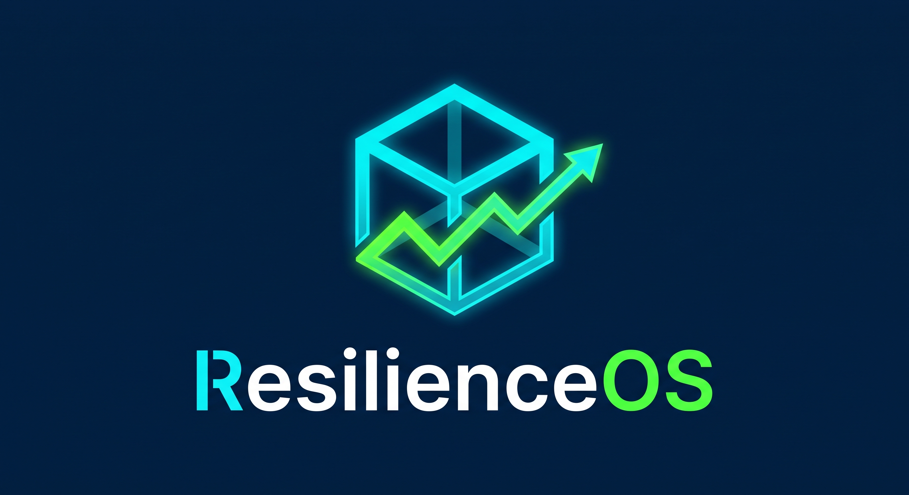
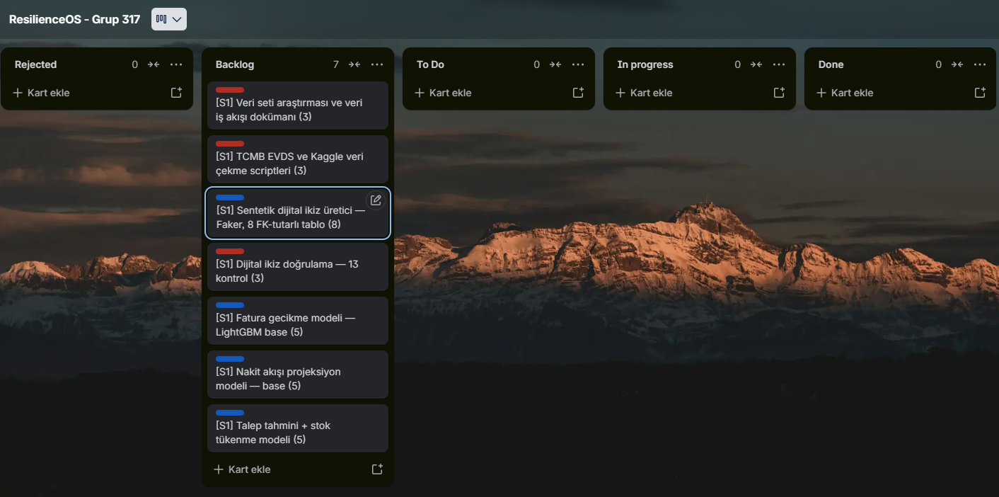
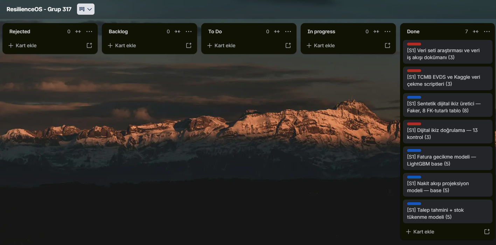
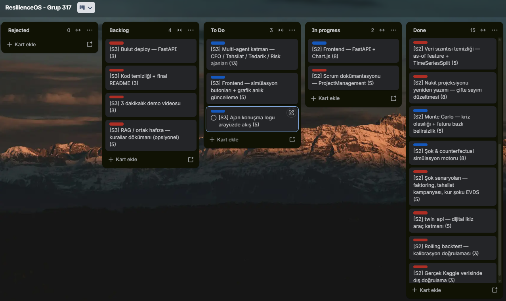

  

# Takım İsmi

**Grup 317 — ResilienceOS**

> 📌 Projenin teknik dokümantasyonu (mimari, modeller, çalıştırma adımları) için:
> [`docs/00_Teknik_README.md`](docs/00_Teknik_README.md)

---

# Ürün İle İlgili Bilgiler

## Takım Elemanları

| İsim | Rol | GitHub |
|------|-----|--------|
| Onur Alp Erol | Scrum Master | [@OnurAlpE](https://github.com/OnurAlpE) |
| İlayda Pekar Özdemir | Product Owner | [@ilaydaOzdmr](https://github.com/ilaydaOzdmr) |
| Furkan Aksoy | Developer (ML & Simülasyon) | [@FurkanAksoyy](https://github.com/FurkanAksoyy) |
| Muhammet Kuş | Developer (Frontend) | [@Kus003](https://github.com/Kus003) |
| İsmail Güler | Developer (Frontend) | _(kullanıcı adı sonra eklenecek)_ |

## Ürün İsmi

**ResilienceOS**

## Ürün Açıklaması

KOBİ'lerin fatura, banka ve stok verilerini tek bir dijital ikizde birleştirip nakit
krizini gerçekleşmeden tahmin eden ve çözüm öneren yapay zekâ destekli karar platformu.

## Ürün Özellikleri

- **Nakit akışı erken uyarısı** — 30 günlük projeksiyon + Monte Carlo ile kriz olasılığı
- **Fatura gecikme tahmini** — LightGBM ile her açık faturanın kaç gün gecikeceği
- **Talep tahmini + stok tükenme analizi** — kritik ürünler için tükenme tarihi
- **Şok & counterfactual simülasyon** — "aksiyonları uygula" motoru (erken ödeme, faktoring, tedarikçi bölme, kur şoku)
- **(Planlanan) Multi-agent karar orkestrası** — CFO / Tahsilat / Tedarik / Risk ajanları

## Hedef Kitle

- KOBİ finans ve ön muhasebe sorumluları
- Mali müşavirler / muhasebeciler
- Nakit akışını yöneten işletme sahipleri

## Product Backlog URL

[Trello — ResilienceOS Grup 317](https://trello.com/b/l6fzbG17/resilienceos-grup-317)

---

# Puanlama / Story Point Mantığı

Kartları **modifiye Fibonacci** ölçeğiyle puanladık (3 · 5 · 8 · 13). Ölçek göreceli;
mutlak değil (puan = saat değil). Her kartı üç sinyale göre değerlendirdik:

1. **Karmaşıklık** — işin kaç hareketli parçası var
2. **Emek** — işin gerektirdiği gerçek iş yükü
3. **Belirsizlik** — daha yapılmamış / riskli işler daha yüksek puan alır

| Puan | Anlamı | Örnek |
|------|--------|-------|
| **3** | Küçük, sınırlı, tek amaçlı | veri çekme scriptleri, doğrulama, deploy, video |
| **5** | Tam bir model / kendi başına özellik | fatura modeli, Monte Carlo |
| **8** | Büyük ya da temel / ağır yeniden yazım | dijital ikiz üretici, nakit yeniden yazım, şok motoru, frontend |
| **13** | En büyük + henüz yapılmamış + en belirsiz | multi-agent katman |

**Renk kodu (Trello etiketleri):**
- 🔵 **Story (mavi)** — ürünün yaptığı, kullanıcının/jürinin gördüğü yetenek
- 🔴 **Task (kırmızı)** — o yeteneği ayakta tutan mühendislik işi (altyapı, düzeltme, doğrulama, dokümantasyon)

> **Not:** Puan ile renk bağımsız iki eksendir. Örn. "Nakit yeniden yazımı" 🔴 task ama
> 8 puan — küçük olduğu için değil, görünmeyen ama ağır bir altyapı düzeltmesi olduğu için.

**Toplam:** 24 kart · 124 puan · Sprint 1: 32 · Sprint 2: 42 · Sprint 3: 50

---

# Sprint 1 — Veri Altyapısı ve Temel Modeller

- **Sprint Notları:** Sentetik dijital ikiz veri seti (Faker, 8 FK-tutarlı tablo) ve ilk
  LightGBM modelleri (fatura gecikme, nakit projeksiyonu, talep/stok) kuruldu. Veri seti
  içine "Temmuz ortası nakit krizi" paterni bilinçli olarak gömüldü.

- **Backlog düzeni ve Story seçimleri:** Kartlar önceliğe göre dizildi; puanlar tek kişide
  yığılmayacak şekilde dağıtıldı. Trello'da story'ler mavi, task'lar kırmızı etiketlendi
  (bkz. yukarıdaki puanlama mantığı). Sprint 1 toplam 32 puan.

- **Daily Scrum:** Toplantılar zamansal sebeplerle çevrimiçi (Google Meet) ve WhatsApp
  üzerinden yapıldı.
  

- **Sprint board update:**
  
  

- **Ürün Durumu:** Ürün kimliği / logo tasarlandı.
  

- **Sprint Review:** Veri altyapısı ve base modeller çalışır hale geldi. 8 tablolu sentetik
  dijital ikiz + 3 LightGBM modeli üretildi, doğrulama 13/13 geçti. Base modellerde veri
  sızıntısı ve veri dengesizliği fark edildi; düzeltme Sprint 2'ye taşındı.

- **Sprint Retrospective:** _(daha sonra doldurulacak)_

---

# Sprint 2 — Model İyileştirme ve Simülasyon Motoru

- **Sprint Notları:** Base modeller yeniden yazıldı (veri sızıntısı giderildi), nakit
  projeksiyonu düzeltildi, olasılıksal kriz değerlendirmesi (Monte Carlo) ve şok /
  counterfactual simülasyon motoru eklendi. `twin_api` araç katmanı hazırlandı.

- **Backlog düzeni ve Story seçimleri:** Sprint 2, model kalitesi ve simülasyon
  odaklıydı. En riskli/ağır kalemler (nakit yeniden yazım 8, şok motoru 8) öne alındı.
  Sprint 2 toplam 42 puan.

- **Daily Scrum:** Google Meet + WhatsApp üzerinden sürdürüldü.
  Kanıt: [`ProjectManagement/Sprint2Documents/`](ProjectManagement/Sprint2Documents/)

- **Sprint board update:**
  

- **Ürün Durumu:** Nakit projeksiyonu artık krizi 0 gün sapmayla öngörüyor; şok motoru
  aksiyonların kriz olasılığını nasıl değiştirdiğini raporluyor.

- **Sprint Review:** Fatura ve talep modellerindeki veri sızıntısı giderildi
  (as-of özellikler + TimeSeriesSplit). Nakit projeksiyonundaki çifte-sayım hatası
  düzeltildi. Monte Carlo ile kriz olasılığı, rolling backtest kalibrasyonu ve gerçek
  Kaggle verisinde dış doğrulama eklendi. Multi-agent katman Sprint 2'ye planlanmıştı;
  ML yeniden yazımları uzayınca Sprint 3'e alındı.

- **Sprint Retrospective:** _(daha sonra doldurulacak)_

---

# Sprint 3 — Arayüz, Agent Katmanı ve Teslim

_(Sprint 3 devam ediyor — içerik sprint sonunda doldurulacak.)_
